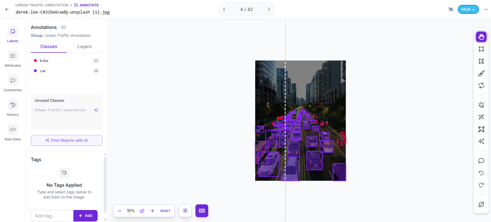
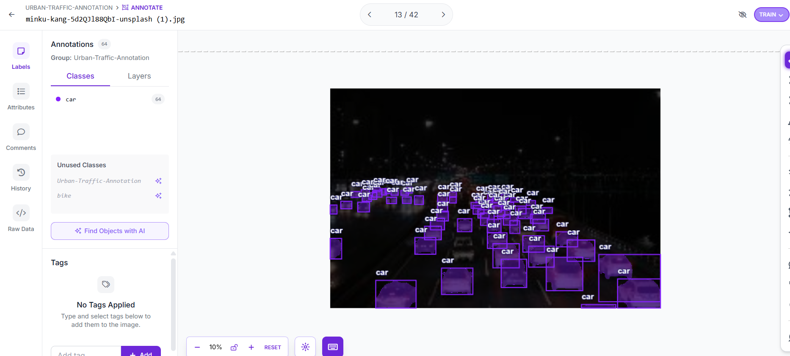

# urban-traffic-data-annotation
High-precision 2D bounding box dataset for urban traffic and mobility, annotated with YOLOv8 formatting and Human-in-the-Loop QA.

# Urban Traffic 2D Bounding Box Annotation Dataset

## Overview
A computer vision dataset curated for urban mobility, autonomous driving systems, and traffic density monitoring. The dataset features precision 2D bounding boxes across dense traffic scenes.

## Dataset Specifications
- **Annotation Platform:** Roboflow
- **Volume:** 42 high-density urban traffic images
- **Target Classes:** `car`, `bike`
- **Output Format:** YOLOv8 PyTorch TXT
- **Methodology:** Foundation pre-labeling paired with a Human-in-the-Loop (HITL) quality assurance pass.

## Annotation Guidelines & QA Rubric
- **Boundary Precision:** Bounding boxes hug outermost visible pixels (bumpers, mirrors, handlebars) with zero loose margins.
- **Occlusion Threshold:** Objects occluded by >70% were excluded to prevent label ambiguity.
- **Quality Assurance:** Manual review pass conducted to eliminate false positives and correct overlapping clusters.

## Annotation Visuals

